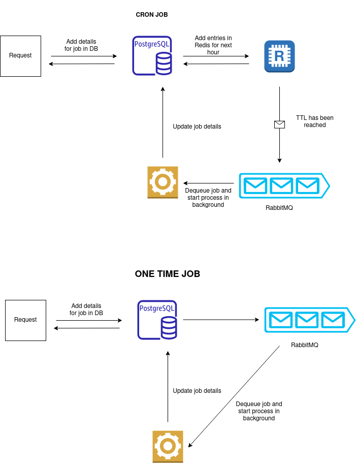

# CronIQ API

CronIQ is a powerful and reliable Node.js API designed to build a job scheduling system that excels in executing, managing, and monitoring various tasks.

## How to Use?

There are two types of jobs supported by CronIQ - "One Time Job" and "Cron Job."

### One Time Job

A one-time job is executed once immediately after creation. If the process takes longer than the provided timeout, it is terminated with a timeout exception.

To create a one-time job, use the `/api/one-time-job/` POST endpoint with the following parameters:

- `code`: The code to be executed for the job.
- `timeout`: The maximum time in milliseconds that a single run of the job might take.

Example:

```json
{
  "code": "console.log('Hello, One Time Job!');",
  "timeout": 5000
}
```

### Cron Job

A cron job is a recurring job that executes based on a cron string. You can specify the cron schedule, end time (when the job's recurrence should be stopped), and timeout for each job.

To create a cron job, use the /api/cron-job/ POST endpoint with the following parameters:

- `cron``: The cron string representing the schedule for the job.
- `code`: The code to be executed for the job.
- `endTime`: The time when the job's recurrence should be stopped (in ISO 8601 format).
- `timeoutMilliseconds`: The maximum time in milliseconds that a single run of the job might take.

Example:

```json
{
  "cron": "*/10 * * * *",
  "code": "console.log('Hello, Cron Job!');",
  "endTime": "2023-08-09T03:00:00.000Z",
  "timeoutMilliseconds": 30000
}
```

### How it Works?



#### One Time Job

- The user creates a one-time job using the `/api/one-time-job/` POST endpoint.
- The API validates the job details.
- A "OneTimeJob" instance is created and stored in the database.
- The job is added directly to the RabbitMQ queue for execution, identified by its job ID and type.
- A 'listener' in CronIQ dequeues the job from RabbitMQ and runs it.
- Once the job is received from the queue, a "JobRun" instance is created for it.
- A background process is spawned to execute the provided code, and the timeout is attached to the process.
- Callbacks are added to handle job completion and store relevant information in the "JobRun."
- When the process completes, the callback adds stdout, stderr, exit codes, etc. to the job run.
- To retrieve job details, use the `/api/one-time-job/:id` endpoint, and for run details, use the `/api/one-time-job/runs/:id` endpoint.

Cron Job

- The user creates a cron job using the `/api/cron-job/` POST endpoint.
- The API validates the job details.
- A "CronJob" instance is created and stored in the database.
- The `scheduleJobsIfApplicable` cron service checks if the job should run in the next hour based on the cron schedule and `TIME_FOR_ADVANCE_CRON_RUNS_MS`.
- If the job should run in the next hour, entries are added to Redis with appropriate TTLs.
- Redis entries are uniquely identified by `jobId-milliseconds-since-epoch`.
- A worker runs every hour (`TIME_FOR_ADVANCE_CRON_RUNS_MS`) and puts jobs in Redis for future executions.
- When the Redis entry expires, the job is dequeued from Redis and added to RabbitMQ for execution.
- A 'listener' in CronIQ dequeues the job from RabbitMQ and runs it.
- Once the job is received from the queue, a "JobRun" instance is created for it.
- A background process is spawned to execute the provided code, and the timeout is attached to the process.
- Callbacks are added to handle job completion and store relevant information in the "JobRun."
- When the process completes, the callback adds stdout, stderr, exit codes, etc. to the job run.
- To retrieve job details, use the `/api/cron-job/:id` endpoint, and for run details, use the `/api/cron-job/runs/:id` endpoint.

Example: Scheduling a Cron Job

Let's consider a cron job with the following configuration:

- Cron Schedule: `*/15 * * * *` (Every 15 minutes)
- Current Time: 11:25 AM

The job should run every 15 minutes, and it's currently 11:25 AM. According to the cron schedule, the job is scheduled to run at the following times: 11:30 AM, 11:45 AM, 12:00 PM, 12:15 PM, 12:30 PM, and so on.

1. At 11:25 AM, i.e. current time, the job is created, the cron service checks if the job should run in the next one hour (`TIME_FOR_ADVANCE_CRON_RUNS_MS`).
   The service adds an entry to Redis with a TTL set for 5 minutes (11:30 AM - 11:25 AM) for 11:20AM, same for 11:30 AM, 11:45 AM, 12:00 PM, 12:15 PM.

2. We also have a worker which runs every 1 hour (`TIME_FOR_ADVANCE_CRON_RUNS_MS`), let's say at 12:05 PM, it looks for jobs that should run in the next hour. It'll find runs for 12:15PM, 12:30PM, 12:45PM, 1:00 PM. Among these, it finds the previously created job scheduled for 12:15 PM. The worker updates the Redis entry for 12:15 PM, shortening the TTL to 10 minutes (12:15 PM - 12:05 PM) because it's now closer to the execution time.

In Redis the job is identified with `<job-sql-id>-<milliseconds-since-epoch>` hence updated directly. Once entries are expired they are added to RabbitMQ and handled as mentioned above.

### ER Diagram


